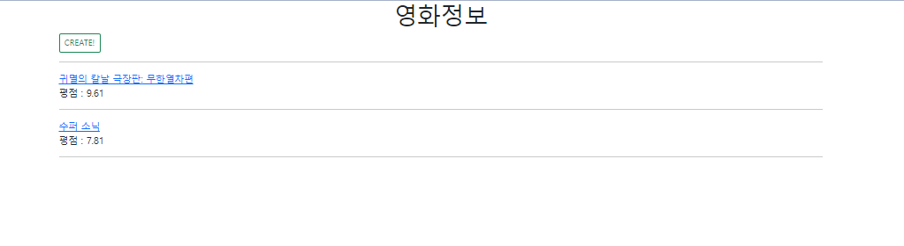
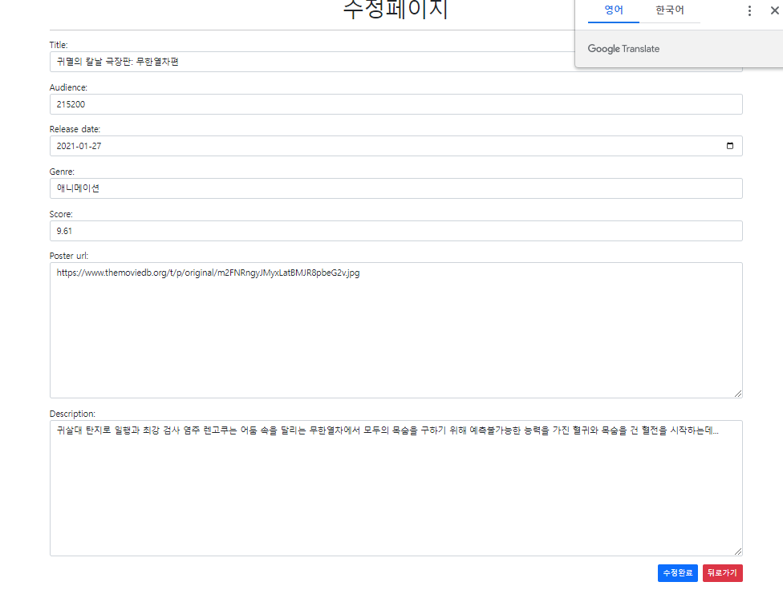
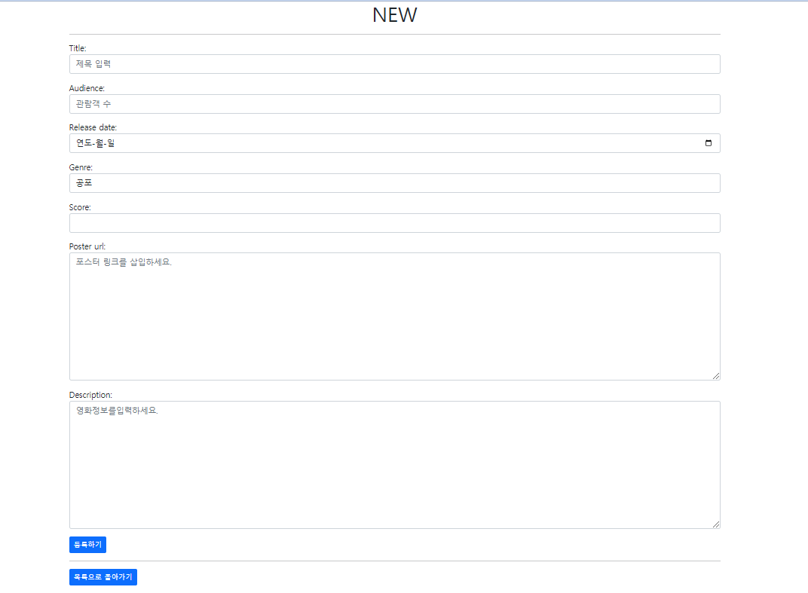

모델폼을 다루는 부분이 어려웠다 처음에 class meta를 안넣어서 자꾸 오류가 났는데 아래 모델폼 css/위젯 부분을 다루면 필드 all 선택을 안해도 되는 줄 알았는데 작성 해 줘야 한다!

```
class MovieForm(forms.ModelForm):
    class Meta:
        model = Movie
        fields = '__all__'
```


select박스도 어려웠는데 라이브강의에서는 폼에서 작성한거라 모델폼과는 달랐다

````
    CHOICES = [('공포', '공포'), ('멜로', '멜로'), ('코미디', '코미디'),('범죄', '범죄'),('애니메이션','애니메이션')]
    genre = forms.ChoiceField(
        label= 'Genre',
        widget= forms.Select(
            attrs={
                'class':'movie-genre form-control',
                'placeholder':'장르'
            },
        ),
        choices=CHOICES,
    )
````

이런식으로 넣어줬더니 됐음!


날짜 위젯도 헤매다가 갓구글의 힘을 빌려 찾았다!

```
    release_date = forms.DateField(
        label='Release date',
        widget=forms.NumberInput(
            attrs={
                'type':'date',
                'class':'my_release form-control',
                'placeholder':'YYYY-M-D'
            }
        )
    )
```


확실히 저번 프로젝트부터, 어제 장고수업들 파일을 보면서 하니까 큰 도움이 됐다

배운 걸 확실하게 정리 해 두는 습관이 나중에 큰 도움이 될 것같음

 






